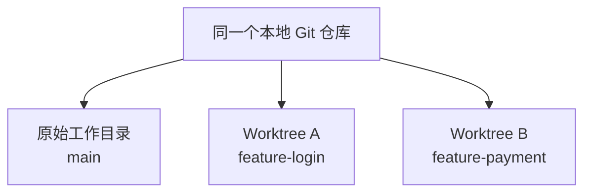
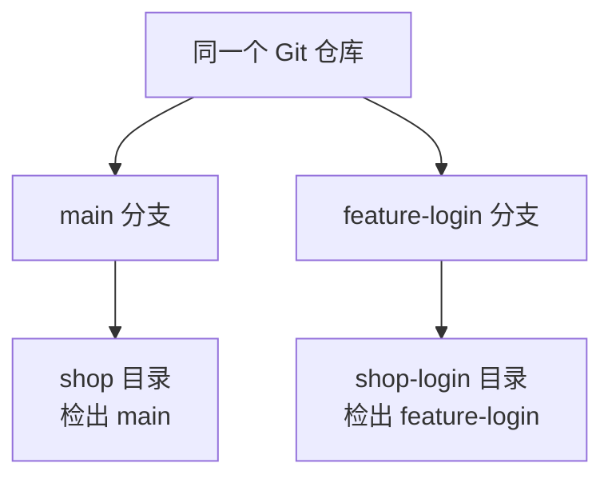
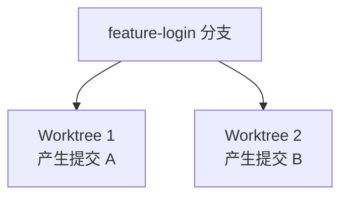
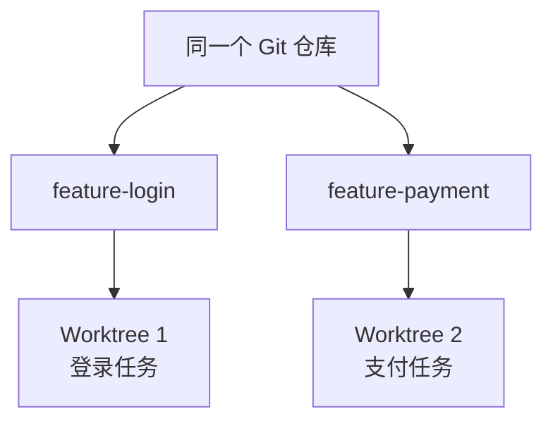

## Codex Windows 原生桌面版修改配置目录

**Codex 桌面版在 Windows 上不会读取 `CODEX_HOME` 环境变量**。该应用将配置路径硬编码在 `%USERPROFILE%\.codex`，无论如何设置环境变量（包括写入 `.env` 文件），桌面版都会忽略它并继续使用默认位置。

此外，`%USERPROFILE%\.codex` 是桌面版和 CLI 共用的默认目录。如果之前用 CLI 或 IDE 扩展设置过用户级 `CODEX_HOME`，桌面版启动时可能会注入自己的路径，进一步覆盖你的设置。

Windows 上官方和社区验证的唯一可靠方案是**使用目录联接（Directory Junction）**，将 `%USERPROFILE%\.codex` 链接到你的目标目录。

> 该方案 2026/9/10 仍可用

### 操作步骤

1. **彻底退出 Codex**：右键点击系统托盘图标退出，并在任务管理器中确认所有 `Codex` 进程已结束。

2. **备份并移动原目录**（以 `E:\Codex-Workplace\.codex` 为例）：

    ```powershell
    # 复制原目录到目标位置
    Copy-Item -Path "$env:USERPROFILE\.codex" -Destination "E:\Codex-Workplace\.codex" -Recurse
    # 重命名原目录作为备份
    Rename-Item -Path "$env:USERPROFILE\.codex" -NewName ".codex_backup"
    ```

3. **创建目录联接**（**必须以管理员身份运行 PowerShell**）：

    ```powershell
    cmd /c mklink /J "$env:USERPROFILE\.codex" "E:\Codex-Workplace\.codex"
    ```

4. **验证联接**：

    ```powershell
    Get-Item "$env:USERPROFILE\.codex" | Format-List LinkType, Target
    # 应显示 LinkType: Junction，Target 指向 E:\Codex-Workplace\.codex
    ```

5. **重启 Codex**，确认配置和会话数据正常加载。


## Codex 桌面版基本使用

Codex 桌面版集成了 ChatGPT 和 Codex。

### 工作模式

ChatGPT 只有标准 Chat 和 Work 两种工作模式，Codex 只有 Codex 工作模式。

| 入口          | 核心用途             | 适合做什么                                           | 额度/环境特点                                                |
| ------------- | -------------------- | ---------------------------------------------------- | ------------------------------------------------------------ |
| **标准 Chat** | 快速对话             | 问答、搜索、头脑风暴、写短文、解释概念               | 面向一次次即时交互；与 Work/Codex 的智能体额度分开           |
| **Work**      | 长流程的通用工作代理 | 调研、分析资料、制作报告、文档、表格、演示文稿或网站 | 可拆解多步骤任务并产出交付物；与 Codex 共用智能体额度        |
| **Codex**     | 软件开发代理         | 写代码、读仓库、调试、跑测试和命令、审查改动         | 可操作本地文件夹、仓库、终端和开发工具；与 Work 共用智能体额度 |

最简单的选择方式：

- 想“聊一聊、马上得到答案” → **标准 Chat**
- 想“把一件非编码工作交给它做完” → **Work**
- 想“让它在项目里实际改代码、验证结果” → **Codex**

举例：

“解释 JVM 垃圾回收”用 Chat；“根据十份资料做一份竞品分析报告”用 Work；“修复这个 Java 项目的内存泄漏、跑测试并给出改动”用 Codex。

### 任务

> 快捷键：`Ctrl + N`
>
> Codex 桌面版可以同时运行多个任务，任务在左侧边栏中会显示相应状态：
>
> - 正在进行
> - 等待审批
> - 已完成

ChatGPT 有两种任务：

1. **工作任务**：可以选择本地文件夹作为项目上下文（工作空间）。通常可在新建任务时选择文件夹；或将文件夹直接拖入 Codex。

    - 同一工作空间中，可以创建多个项目任务。它们共享该项目的文件上下文，但各自保留独立的对话和执行状态。

2. **聊天任务**：没有绑定工作空间的任务。所有聊天任务统一显示在对话区域，存储位置可在设置中修改。

    

> 两种工作模式下，根据任务是否绑定工作空间，区分工作任务，聊天任务。

Codex 只有 Codex 工作模式。也只有工作任务，无论任务是否绑定工作空间。

> 聊天任务单独隔离在 ChatGPT 中，工作任务由 ChatGPT 和 Codex 共享。


## 功能模块

### 搜索历史对话

只能搜索历史对话的标题。

> 快捷键 `Ctrl + K`


### 会话重命名

双击左侧边栏中的会话，即可修改会话标题。

### 归档

> 快捷键：`Ctrl + shift + A`


归档 = **从左侧列表隐藏，但不删除**。

- 对话内容仍保存在账号中，之后可在“设置 → 已归档聊天”找到。
- 归档不会删除其中已保留的关联应用数据。
- 真正删除才会从记录中移除，并安排在 30 天内从 OpenAI 系统永久删除。

> 工作任务必须归档后才能删除，聊天任务可以直接删除。

### 权限管理

权限由两部分共同决定：

- `沙箱边界` → 决定 Codex 能访问哪些文件与网络资源

    > Codex的权限控制是围绕沙箱展开的，会将当前工作空间（项目文件夹）作为沙箱进行管理。

- `审批机制` → 决定越过边界时由用户审批，还是交给自动审查

#### 入口

可在输入框下方的权限控件中切换模式。首次使用时，需先在设置中启用才会出现在菜单中。


#### 三种权限总结说明

- `请求审批`：工作空间内可自主操作，越界先问你。
- `自动审查`：权限边界不变，越界请求交给审查智能体。
- `完全访问`：取消本地文件与网络沙箱限制，也不再逐项审批。

#### 请求批准（默认）

Codex 可在当前工作空间内读取、编辑文件，并运行常规本地命令。

当它需要：

- 修改工作空间之外的文件
- 使用网络
- 执行其他越过当前沙箱边界的操作

会暂停并请求用户审批。

> 这里的“工作空间”是主要边界，但并不必然等于“整个项目目录完全可写”：具体可写路径还可能受配置限制，部分受保护路径也可能保持只读。

#### 帮我批准

该模式与“请求审批”使用**相同的沙箱边界**。

当 Codex 需要越过边界时，请求不会直接弹给用户，而是交给独立的审查智能体判断。审查通过则继续执行；被拒绝时，主智能体应改用明显更安全的方法，或停止并向用户询问。

注意：

- 自动审查不是“低风险自动放行、高风险人工审批”的固定规则
- 它不增加可写目录，不开启网络，也不削弱受保护路径
- 它只审查原本就需要审批的越界操作
- 自动审查可能出错，不能代替最小权限、隔离和人工判断

#### 完全访问（高风险）

完全访问对应无沙箱、无审批的运行方式。启用后，Codex 可以：

- 编辑电脑上的任意文件
- 运行可联网的命令
- 不再为这些操作请求你的批准

这会显著增加误删数据、泄露敏感信息和意外执行操作的风险。仅应在你信任当前任务、代码、提示内容和外部依赖时临时使用；普通开发任务优先选择“请求审批”或“替我审批”。

### 上下文窗口与上下文压缩

#### 上下文窗口是什么

上下文窗口是当前模型一次可接收和参考的信息容量，通常以 Token 计量。

界面中的“上下文使用量”应理解为**当前模型可见上下文的占用情况**。

可以在对话框输入 `/status`，查看当前聊天的上下文使用量等状态信息。


#### 压缩上下文

当上下文逐渐接近模型可用容量时，Codex 可以自动压缩较早的对话历史，以降低 Token 占用并为后续工作腾出空间。自动压缩的触发点由模型默认值或配置的 Token 阈值决定，因此不一定要等到“已经超过上限”才发生。

可以在对话框输入 `/compact`，手动压缩当前聊天的上下文。

压缩不是原样保存全部历史，而是保留继续完成当前任务所需的关键信息。因此它有损，但适合让同一项长任务持续进行。

#### 新建聊天还是压缩

选择原则：

`同一目标仍在继续` → 优先压缩

- 正在持续排查同一个问题
- 需要保留前面的技术决策、约束、命令结果或文件修改
- 长时间、多工具调用的同一任务

`目标、产物或角色已经变化` → 优先新建聊天（保留旧聊天作为记录）

- 开始一个不同的需求、功能或产物
- 旧讨论包含大量与新任务无关的尝试、错误和分支
- 希望模型只关注新的明确目标

若新任务只需要继承少量结论，可在新聊天开头提供简短交接信息，例如：目标、已确认结论、关键文件和下一步。

> “历史越多，模型越不专注”是经验之谈。问题不在于历史本身，而在于模型可见上下文中混入了大量不相关、冲突或过时的信息。

### 模型推理强度

付费用户可通过推理滑块选择强度：

| 强度       | 适用场景               |
| ---------- | ---------------------- |
| Instant    | 日常快速问答           |
| Medium     | 标准推理               |
| High       | 复杂、多步骤任务       |
| Extra High | 复杂、多步骤任务       |
| Ultra      | 最难、耗时更长的工作流 |


切换推理强度本质上是在**答案质量**和**响应速度/成本**之间做取舍。

- **低档位**：追求**极速响应**和**低成本**，适合“快问快答”。
- **中档位**：默认设置，**平衡**了质量与速度。
- **高档位（高/极高）**：模型会进行**多步骤推理**，处理复杂问题时**准确率更高**。但代价是速度变慢，且**耗费更多计算资源和配额**。
- **超高档位**：动用**极限资源**，甚至调用多个“子AI”并行工作，用于攻克顶级难题。普通用户通常接触不到。

所以正确用法是：**先选对模型，再调强度**。处理简单日常问题用Luna配低档位；复杂编程或深度研究用Sol配高档位。

> 即使保持 Instant，系统也可在复杂任务中自动增加推理，但这不会占用手动选择推理档位的额度。

### 模型推理速度

**“1.5× speed”**表示“运行速度倍率”。开启后，任务会以 1.5 倍的普通速度执行，双倍消耗 Work/Codex 的额度。


> 这不会提升模型能力或推理强度，只是能够更快地完成任务。


## Codex 控制与引导

当 Codex 正在执行任务时，用户不必等它完成就可以补充信息或纠正方向。


- 等待下一次运行（加入队列）：新消息会等待当前任务结束后，再作为下一次运行的输入处理。

    > 推荐保持“加入队列”，引导操作可以在会话中临时切换。

- 引导当前运行（调整方向）：新消息会追加到当前进行中的任务，用于调整接下来的执行方向，而不会另开一次运行。

    > 引导不是“撤销已发生的操作”，而是“修改将要发生的操作”。如果命令或工具调用已经开始，新的引导通常要等到安全的处理节点才会被纳入后续步骤。

如果 Codex 正在执行明显错误、风险较高或不应继续的操作，不应仅依赖引导，而应使用界面的停止/中断操作取消当前运行，再给出新的明确指令。

- `发现方向偏差但当前步骤可安全完成` → 引导
- `补充后续需求，不影响当前步骤` → 排队
- `当前操作不应继续` → 中断后重述任务


## 计划模式和批注模式

### 计划模式

普通模式下，Codex 可以直接开始分析、修改和验证任务。

计划模式通过 `/plan` 开启，适用于先梳理范围、风险、步骤和验证方式，再决定如何实施的多步骤任务。

推荐工作流：

```
描述目标 → Codex 分析并提出计划 / 必要问题 → 讨论和调整计划 → 明确要求实施 → Codex 执行
```

注意：计划模式本身不等于“必须人工确认后才能执行”。如果希望计划阶段绝不修改文件，应在任务中明确说明：

```text
先分析并给出计划；在我确认前，不要修改文件或运行会改变状态的命令。
```

### 浏览器批注模式

浏览器批注用于反馈**渲染后的页面**中才看得见的问题，例如布局、溢出、间距、颜色、文案和响应式表现。

操作流程：

```
打开页面 → 开启批注模式（右上角） → 点击元素或拖动选择区域 → 撰写并保存批注 → 在聊天中要求 Codex 处理这些批注
```

批注应同时描述“问题”和“期望结果”，例如：

```text
此按钮在手机宽度下溢出。优先保持单行；若必须换行，也不要改变卡片高度。
```

对于样式问题，可在添加批注时使用“调整”功能，直接查看字体、文本、间距、颜色等修改的页面预览。

> 浏览器中的页面内容可能是不可信输入。涉及登录态、敏感数据或有副作用的网站操作时，应先审查页面与拟执行动作。


## 目标


## 代码管理

Codex 不是传统 IDE：它不以手写代码、语法补全和断点调试为中心。它通过智能体读取、修改和验证项目文件，并提供集成终端、差异审查和部分 Git 操作。

所以需要额外安装 IDE，从而获得对人类更友好的开发体验。


> 某个项目中单独选择的编辑器会优先于全局设置。

### 分支

### Worktree


Worktree（工作树）是一种 **Git 提供的并行开发机制**，它可以**为同一个代码仓库创建多个独立的物理工作目录**，使不同任务能够同时修改代码而互不干扰。

> 最初通过 `git clone` 得到的项目目录，本身就是一个 Worktree，通常称为“主工作树”。后来通过 `git worktree` 创建的是额外 Worktree。



不同 Worktree：

- 共享 Git 数据库
- 拥有各自完整的项目文件
- 拥有各自的未提交修改
- 可以处理不同分支或不同任务

> Worktree 是本地项目目录；分支是 Git 历史中的提交指针。
>
> Worktree 可以把某个分支对应的代码检出出来。但为了防止两个目录同时修改同一个分支指针，同一个分支通常不能同时被两个 Worktree 检出。

#### 为什么使用 Worktree

如果直接在本地项目中让多个 Codex 任务同时修改代码，可能出现：

- 不同任务修改混在一起
- 一个任务覆盖另一个任务的代码
- 测试结果相互影响
- 提交时难以区分修改来源
- 无法安全切换分支

使用 Worktree 后，每个任务都有独立目录：

```
一个任务 → 一个 Worktree → 一组修改 → 一个分支 → 一个提交或 Pull Request
```

特别适合：

- **同时开发多个功能**
- 一边开发功能，一边修复 Bug
- 让多个 Codex 任务并行工作
- 尝试风险较高的重构
- 保持本地主工作区干净
- 在不打断当前工作的情况下执行后台任务

#### 为什么修改互不影响

假设两个目录中都有 `Home.vue`：

```
D:\projects\shop\src\Home.vue
D:\projects\shop-login\src\Home.vue
```

它们是硬盘上两个不同位置的文件。

你在 `shop-login` 中修改：

```
D:\projects\shop-login\src\Home.vue
```

不会改变：

```
D:\projects\shop\src\Home.vue
```

因为它们不是同一个文件。

#### 分支对 Worktree 的作用

例如，Git 仓库中有两个分支：

- `main`：稳定版本
- `feature-login`：登录功能版本

可以让不同 Worktree 使用不同分支：



于是：

- 在 `shop` 目录提交代码，会推进 `main`

- 在 `shop-login` 目录提交代码，会推进 `feature-login`

- 两边的文件和未提交修改彼此独立

- 两边产生的提交都保存在同一个 Git 数据库中

- Worktree 不会自动同步。要让另一个 Worktree 使用新代码，仍然需要执行合并或切换到相应提交。

    > 可以理解为：两个房间共用一个档案室，但每个房间桌面上的文件不会自动同步。

#### 同一个分支不能同时用于两个 Worktree

假设两个 Worktree都使用 `feature-login`：



两个目录可能同时尝试改变 `feature-login` 指向的提交，Git将无法确定哪一个才是该分支的权威状态。

因此，Git通常禁止同一个分支同时被两个 Worktree检出。

正确方式是：



一个任务使用一个 Worktree，同时使用一个独立分支。

#### 推荐工作流程

```
更新主分支
    ↓
确认工作区状态
    ↓
为每个任务创建独立 Worktree
    ↓
Codex 修改并运行测试
    ↓
人工检查差异
    ↓
在 Worktree 中创建功能分支
    ↓
提交并推送
    ↓
创建 Pull Request
    ↓
合并回主分支
```