## Codex Windows 原生桌面版修改配置目录

**Codex 桌面版在 Windows 上不会读取 `CODEX_HOME` 环境变量**。该应用将配置路径硬编码在 `%USERPROFILE%\.codex`，无论如何设置环境变量（包括写入 `.env` 文件），桌面版都会忽略它并继续使用默认位置。

此外，`%USERPROFILE%\.codex` 是桌面版和 CLI 共用的默认目录。如果之前用 CLI 或 IDE 扩展设置过用户级 `CODEX_HOME`，桌面版启动时可能会注入自己的路径，进一步覆盖你的设置。

Windows 上官方和社区验证的唯一可靠方案是**使用目录联接（Directory Junction）**，将 `%USERPROFILE%\.codex` 链接到你的目标目录。

> 该方案 2026/9/10 仍可用

### 操作步骤

1. **彻底退出 Codex**：右键点击系统托盘图标退出，并在任务管理器中确认所有 `Codex` 进程已结束。

2. **备份并移动原目录**（以 `E:\Codex-Workplace\.codex` 为例）：

    ```powershell
    # 复制原目录到目标位置
    Copy-Item -Path "$env:USERPROFILE\.codex" -Destination "E:\Codex-Workplace\.codex" -Recurse
    # 重命名原目录作为备份
    Rename-Item -Path "$env:USERPROFILE\.codex" -NewName ".codex_backup"
    ```

3. **创建目录联接**（**必须以管理员身份运行 PowerShell**）：

    ```powershell
    cmd /c mklink /J "$env:USERPROFILE\.codex" "E:\Codex-Workplace\.codex"
    ```

4. **验证联接**：

    ```powershell
    Get-Item "$env:USERPROFILE\.codex" | Format-List LinkType, Target
    # 应显示 LinkType: Junction，Target 指向 E:\Codex-Workplace\.codex
    ```

5. **重启 Codex**，确认配置和会话数据正常加载。


## Codex 桌面版基本使用

Codex 桌面版集成了 ChatGPT 和 Codex。

### 工作模式

ChatGPT 只有标准 Chat 和 Work 两种工作模式，Codex 只有 Codex 工作模式。

| 入口          | 核心用途             | 适合做什么                                           | 额度/环境特点                                                |
| ------------- | -------------------- | ---------------------------------------------------- | ------------------------------------------------------------ |
| **标准 Chat** | 快速对话             | 问答、搜索、头脑风暴、写短文、解释概念               | 面向一次次即时交互；与 Work/Codex 的智能体额度分开           |
| **Work**      | 长流程的通用工作代理 | 调研、分析资料、制作报告、文档、表格、演示文稿或网站 | 可拆解多步骤任务并产出交付物；与 Codex 共用智能体额度        |
| **Codex**     | 软件开发代理         | 写代码、读仓库、调试、跑测试和命令、审查改动         | 可操作本地文件夹、仓库、终端和开发工具；与 Work 共用智能体额度 |

最简单的选择方式：

- 想“聊一聊、马上得到答案” → **标准 Chat**
- 想“把一件非编码工作交给它做完” → **Work**
- 想“让它在项目里实际改代码、验证结果” → **Codex**

举例：

“解释 JVM 垃圾回收”用 Chat；“根据十份资料做一份竞品分析报告”用 Work；“修复这个 Java 项目的内存泄漏、跑测试并给出改动”用 Codex。

### 任务

> 快捷键：`Ctrl + N`
>
> Codex 桌面版可以同时运行多个任务，任务在左侧边栏中会显示相应状态：
>
> - 正在进行
> - 等待审批
> - 已完成

- ChatGPT 的标准 Chat 模式创建任务无法选择工作空间，Work 模式可以选择。
- Codex 的 Codex 模式创建任务也可选工作空间

> 同一工作空间中，可以创建多个工作任务。它们共享该项目的文件上下文，但各自的对话和执行状态独立。

绑定工作空间的任务统一显示在项目区域，没有绑定工作空间的任务统一显示在对话区域，存储位置可在设置中修改。


## 功能模块

### 搜索历史对话

只能搜索历史对话的标题。

> 快捷键 `Ctrl + K`


### 会话重命名

双击左侧边栏中的会话，即可修改会话标题。

### 归档

> 快捷键：`Ctrl + shift + A`


归档 = **从左侧列表隐藏，但不删除**。

- 对话内容仍保存在账号中，之后可在“设置 → 已归档聊天”找到。
- 归档不会删除其中已保留的关联应用数据。
- 真正删除才会从记录中移除，并安排在 30 天内从 OpenAI 系统永久删除。

> 工作任务必须归档后才能删除，聊天任务可以直接删除。

### 权限管理

权限由两部分共同决定：

- `沙箱边界` → 决定 Codex 能访问哪些文件与网络资源

    > Codex的权限控制是围绕沙箱展开的，会将当前工作空间（项目文件夹）作为沙箱进行管理。

- `审批机制` → 决定越过边界时由用户审批，还是交给自动审查

#### 入口

可在输入框下方的权限控件中切换模式。首次使用时，需先在设置中启用才会出现在菜单中。


#### 三种权限总结说明

- `请求审批`：工作空间内可自主操作，越界先问你。
- `自动审查`：权限边界不变，越界请求交给审查智能体。
- `完全访问`：取消本地文件与网络沙箱限制，也不再逐项审批。

#### 请求批准（默认）

Codex 可在当前工作空间内读取、编辑文件，并运行常规本地命令。

当它需要：

- 修改工作空间之外的文件
- 使用网络
- 执行其他越过当前沙箱边界的操作

会暂停并请求用户审批。

> 这里的“工作空间”是主要边界，但并不必然等于“整个项目目录完全可写”：具体可写路径还可能受配置限制，部分受保护路径也可能保持只读。

#### 帮我批准

该模式与“请求审批”使用**相同的沙箱边界**。

当 Codex 需要越过边界时，请求不会直接弹给用户，而是交给独立的审查智能体判断。审查通过则继续执行；被拒绝时，主智能体应改用明显更安全的方法，或停止并向用户询问。

注意：

- 自动审查不是“低风险自动放行、高风险人工审批”的固定规则
- 它不增加可写目录，不开启网络，也不削弱受保护路径
- 它只审查原本就需要审批的越界操作
- 自动审查可能出错，不能代替最小权限、隔离和人工判断

#### 完全访问（高风险）

完全访问对应无沙箱、无审批的运行方式。启用后，Codex 可以：

- 编辑电脑上的任意文件
- 运行可联网的命令
- 不再为这些操作请求你的批准

这会显著增加误删数据、泄露敏感信息和意外执行操作的风险。仅应在你信任当前任务、代码、提示内容和外部依赖时临时使用；普通开发任务优先选择“请求审批”或“替我审批”。

### 上下文窗口与上下文压缩

#### 上下文窗口是什么

上下文窗口是当前模型一次可接收和参考的信息容量，通常以 Token 计量。

界面中的“上下文使用量”应理解为**当前模型可见上下文的占用情况**。

可以在对话框输入 `/status`，查看当前聊天的上下文使用量等状态信息。


#### 压缩上下文

当上下文逐渐接近模型可用容量时，Codex 可以自动压缩较早的对话历史，以降低 Token 占用并为后续工作腾出空间。自动压缩的触发点由模型默认值或配置的 Token 阈值决定，因此不一定要等到“已经超过上限”才发生。

可以在对话框输入 `/compact`，手动压缩当前聊天的上下文。

压缩不是原样保存全部历史，而是保留继续完成当前任务所需的关键信息。因此它有损，但适合让同一项长任务持续进行。

#### 新建聊天还是压缩

选择原则：

`同一目标仍在继续` → 优先压缩

- 正在持续排查同一个问题
- 需要保留前面的技术决策、约束、命令结果或文件修改
- 长时间、多工具调用的同一任务

`目标、产物或角色已经变化` → 优先新建聊天（保留旧聊天作为记录）

- 开始一个不同的需求、功能或产物
- 旧讨论包含大量与新任务无关的尝试、错误和分支
- 希望模型只关注新的明确目标

若新任务只需要继承少量结论，可在新聊天开头提供简短交接信息，例如：目标、已确认结论、关键文件和下一步。

> “历史越多，模型越不专注”是经验之谈。问题不在于历史本身，而在于模型可见上下文中混入了大量不相关、冲突或过时的信息。

### 模型推理强度

付费用户可通过推理滑块选择强度：

| 强度       | 适用场景               |
| ---------- | ---------------------- |
| Instant    | 日常快速问答           |
| Medium     | 标准推理               |
| High       | 复杂、多步骤任务       |
| Extra High | 复杂、多步骤任务       |
| Ultra      | 最难、耗时更长的工作流 |


切换推理强度本质上是在**答案质量**和**响应速度/成本**之间做取舍。

- **低档位**：追求**极速响应**和**低成本**，适合“快问快答”。
- **中档位**：默认设置，**平衡**了质量与速度。
- **高档位（高/极高）**：模型会进行**多步骤推理**，处理复杂问题时**准确率更高**。但代价是速度变慢，且**耗费更多计算资源和配额**。
- **超高档位**：动用**极限资源**，甚至调用多个“子AI”并行工作，用于攻克顶级难题。普通用户通常接触不到。

所以正确用法是：**先选对模型，再调强度**。处理简单日常问题用Luna配低档位；复杂编程或深度研究用Sol配高档位。

> 即使保持 Instant，系统也可在复杂任务中自动增加推理，但这不会占用手动选择推理档位的额度。

### 模型推理速度

**“1.5× speed”**表示“运行速度倍率”。开启后，任务会以 1.5 倍的普通速度执行，双倍消耗 Work/Codex 的额度。


> 这不会提升模型能力或推理强度，只是能够更快地完成任务。

### 计划模式

普通模式下，Codex 可以直接开始分析、修改和验证任务。

计划模式通过 `/plan` 开启，适用于先梳理范围、风险、步骤和验证方式，再决定如何实施的多步骤任务。

推荐工作流：

```
描述目标 → Codex 分析并提出计划 / 必要问题 → 讨论和调整计划 → 明确要求实施 → Codex 执行
```

注意：计划模式本身不等于“必须人工确认后才能执行”。如果希望计划阶段绝不修改文件，应在任务中明确说明：

```text
先分析并给出计划；在我确认前，不要修改文件或运行会改变状态的命令。
```

### 浏览器批注模式

浏览器批注用于反馈**渲染后的页面**中才看得见的问题，例如布局、溢出、间距、颜色、文案和响应式表现。

操作流程：

```
打开页面 → 开启批注模式（右上角） → 点击元素或拖动选择区域 → 撰写并保存批注 → 在聊天中要求 Codex 处理这些批注
```

批注应同时描述“问题”和“期望结果”，例如：

```text
此按钮在手机宽度下溢出。优先保持单行；若必须换行，也不要改变卡片高度。
```

对于样式问题，可在添加批注时使用“调整”功能，直接查看字体、文本、间距、颜色等修改的页面预览。

> 浏览器中的页面内容可能是不可信输入。涉及登录态、敏感数据或有副作用的网站操作时，应先审查页面与拟执行动作。

### 目标

#### 目标是什么

Codex 的目标功能通过 `/goal` 设置一个**能够跨多个执行轮次持续存在的任务目标**。

普通提示词通常表示：


目标模式则表示：

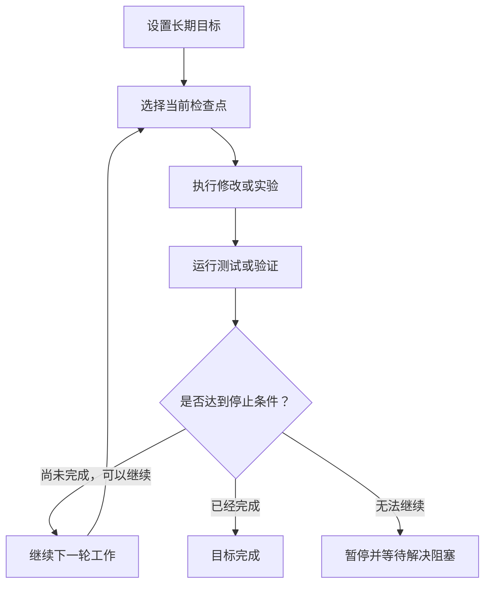

它适合需要 Codex持续工作多个轮次，直到满足明确、可验证条件的任务。

> [OpenAI 官方文档：持续推进目标](https://learn.chatgpt.com/use-cases/follow-goals?translationFallback=zh-Hans)

#### 为什么需要目标功能

普通任务通常适合一次或少数几次操作，例如：

- 修改一个按钮的文字
- 解释一段代码
- 修复一个范围明确的小错误
- 为一个方法补充单元测试

但是有些任务无法在一个执行轮次内完成：

- 迁移整个技术栈
- 重构大型模块
- 持续运行实验并根据结果调整
- 反复修复测试，直到全部通过
- 创建一个完整原型并持续完善
- 处理需要多个检查点的长期任务

**如果只使用普通提示词，Codex 可能完成一个阶段后就返回结果，等待用户再次告诉它继续。**

目标功能相当于明确告诉 Codex：这不是只执行一步的普通任务。**只要还没有达到完成条件，就继续寻找下一步并推进。**

适合：

- 有明确最终结果
- 可以拆分为多个检查点
- 每个检查点都能验证
- Codex可以独立取得进展
- 预计需要多个轮次
- 有明确停止条件

#### 工作原理

目标功能并不是让模型在一次回答中连续思考几个小时。

更准确地说，可以把它理解为 Codex 在产品层面保存了一份“持续任务状态”，然后让模型分多个轮次推进。

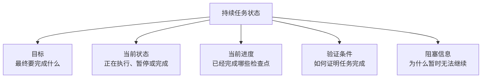

每一轮大致执行以下过程：

1. 读取持续目标
2. 检查当前项目状态
3. 判断下一个可以完成的检查点
4. 修改代码或执行其他操作
5. 运行测试、构建或其他验证
6. 判断是否达到停止条件
7. 未达到则进入下一轮
8. 达到条件则完成目标
9. 真正无法继续时暂停或报告阻塞

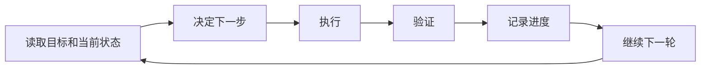

因此，“持续”主要体现在：

- 目标不会随着一次普通回复结束而立即消失
- Codex 可以在多个轮次之间继续追踪同一个目标
- 每轮都根据当前结果决定下一步
- 任务可以通过验证循环持续推进
- 用户不需要每完成一步都手动发送“继续”

#### 目标不是模型的长期记忆

目标、上下文和项目文件是三个不同概念。

- **目标**：记录当前任务要持续追求的结果和停止条件。
- **上下文**：保存模型当前能够参考的对话、文件内容和执行结果。
- **项目文件**：保存在本地目录、Worktree 或远程环境中的实际代码和文档。

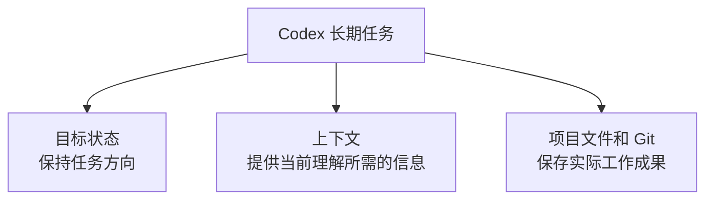

对于重要的长期任务，仍然应该：

- 使用独立分支或 Worktree
- 分阶段创建 Git提交
- 把重要要求写入 `PLAN.md`、需求文档或项目文件
- 在每个检查点运行测试
- 定期检查差异和进度

#### 什么是“停止条件”

目标功能最重要的不是“持续工作”，而是**知道什么时候算完成**。

下面的目标不够明确：

```
/goal 把这个项目优化好
```

因为“优化好”无法验证，Codex不知道：

- 要优化性能还是代码结构
- 哪些模块可以修改
- 什么结果算成功
- 什么时候应该停止

更好的目标是：

```
/goal 将项目从旧版用户认证模块迁移到新版认证模块。

要求：
- 保持现有接口兼容；
- 不修改支付模块；
- 为登录和刷新令牌流程补充测试；
- 每完成一个阶段运行测试；
- 所有相关测试通过后停止；
- 如果必须修改公开接口，暂停并向我说明。
```

这里定义了：

- 最终目标
- 修改范围
- 禁止修改的内容
- 验证方法
- 完成条件
- 暂停条件

#### 如何使用 `/goal`

设置目标：

```
/goal 完成 [具体目标]，直到 [可验证的结束条件]。
```

查看当前目标：

```
/goal
```

暂停目标：

```
/goal pause
```

恢复目标：

```
/goal resume
```

清除目标：

```
/goal clear
```

如果命令列表中没有 `/goal`，官方文档说明该功能可能尚未启用。可以在 `config.toml` 中启用：

```toml
[features]
goals = true
```

也可以使用 CLI：

```powershell
codex features enable goals
```

#### 目标、计划模式和普通任务的区别

| 功能       | 主要用途                           | 是否持续执行                     |
| ---------- | ---------------------------------- | -------------------------------- |
| 普通提示词 | 完成一次范围明确的任务             | 通常执行一轮后返回               |
| 计划模式   | 分析需求并制定实施步骤             | 重点是**规划**，仍执行一轮后返回 |
| `/goal`    | 持续推进长期任务，直到满足停止条件 | **可以跨多个轮次持续工作**       |

计划模式回答的是：

> 这件事应该怎样做？

目标功能回答的是：

> 只要还没达到完成条件，下一步应该继续做什么？

两者也可以组合使用：


#### 目标模板

```
/goal 完成【最终目标】。

修改范围：
- 可以修改：
- 不要修改：

执行要求：
- 开始前先读取：
- 按以下检查点推进：
- 每完成一个检查点执行：

完成条件：
- 当以下条件全部满足时结束：

暂停条件：
- 遇到以下情况时不要自行决定，请暂停并说明：

进度报告：
- 简要说明当前检查点、已经验证的内容和剩余工作。
```

### 定时任务

定时任务又称**计划任务**。

已安排任务让 ChatGPT 在未来某一时刻或按固定频率运行：可以是一次性提醒、每日/每周的内容推送，也可以监控变化后通知你。任务会在用户不在线时照常执行，并通过推送或邮件通知；之后可在 **Scheduled** 页面查看、编辑（例如设置继续在已有任务中运行，或每次运行时新建聊天）、暂停或删除。可用性、精确时间与频率取决于你的账户、设备和套餐。

> [OpenAI 计划任务说明](https://learn.chatgpt.com/docs/automations?translationFallback=zh-Hans)


## Codex 控制与引导

当 Codex 正在执行任务时，用户不必等它完成就可以补充信息或纠正方向。


- 等待下一次运行（加入队列）：新消息会等待当前任务结束后，再作为下一次运行的输入处理。

    > 推荐保持“加入队列”，引导操作可以在会话中临时切换。

- 引导当前运行（调整方向）：新消息会追加到当前进行中的任务，用于调整接下来的执行方向，而不会另开一次运行。

    > 引导不是“撤销已发生的操作”，而是“修改将要发生的操作”。如果命令或工具调用已经开始，新的引导通常要等到安全的处理节点才会被纳入后续步骤。

如果 Codex 正在执行明显错误、风险较高或不应继续的操作，不应仅依赖引导，而应使用界面的停止/中断操作取消当前运行，再给出新的明确指令。

- `发现方向偏差但当前步骤可安全完成` → 引导
- `补充后续需求，不影响当前步骤` → 排队
- `当前操作不应继续` → 中断后重述任务


## 代码管理

Codex 不是传统 IDE：它不以手写代码、语法补全和断点调试为中心。它通过智能体读取、修改和验证项目文件，并提供集成终端、差异审查和部分 Git 操作。

所以需要额外安装 IDE，从而获得对人类更友好的开发体验。


> 某个项目中单独选择的编辑器会优先于全局设置。

### 分支

#### 会话分支是什么

Codex 中对某个回复“创建分支”，本质上是：

> 复制从会话开始到该回复为止的历史记录，创建一个拥有新任务 ID 的独立会话。

原会话不会被修改或删除。

假设原会话是：


如果从第 2 轮的回复创建会话分支，就会变成：

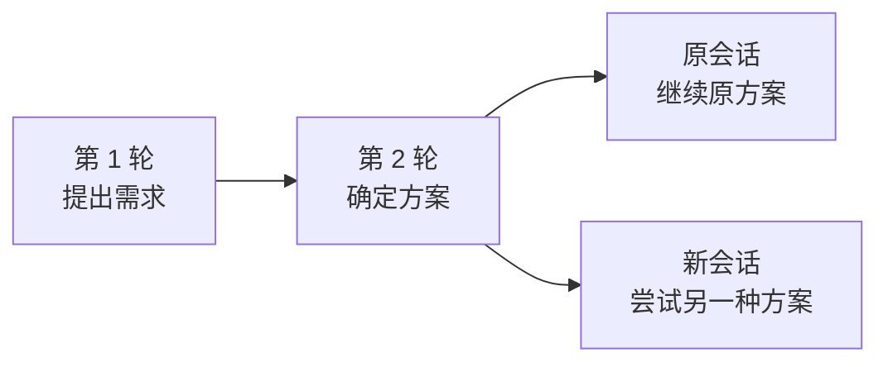

两个会话拥有相同的前半段历史，但后面的历史各自独立。

#### 分支的作用

会话分支最适合用于：**保留当前方案，同时从过去的某个节点尝试另一条思路。**

例如，你先让 Codex采用 Vue 开发：

```
使用 Vue 实现管理后台
```

后续已经讨论了数据库、接口和页面结构。现在你想比较 React方案，但不想删除现有 Vue讨论，就可以从确定技术栈之前的回复创建分支。

```
flowchart LR
    A["提出后台需求"]
    B["分析功能和页面"]
    V["原会话<br/>使用 Vue"]
    R["分支会话<br/>改用 React"]

    A --> B
    B --> V
    B --> R
```

这样：

- 原会话继续保留 Vue方案
- 新会话继承前面的项目背景
- 新会话可以从分叉点开始尝试 React
- 两个会话独立工作

#### 工作原理

**Codex 把一段完整会话称为 Thread，一次用户请求及其对应的智能体执行称为 Turn**。

创建会话分支时，系统大致会执行以下过程：

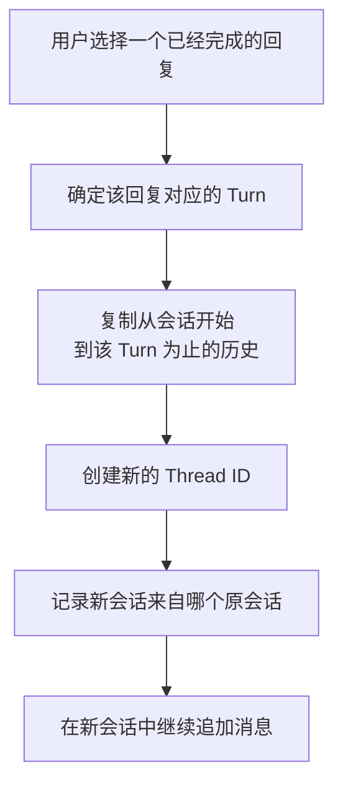

官方的底层接口将这个操作称为 `thread/fork`。

> [OpenAI 官方文档：Codex App Server](https://learn.chatgpt.com/docs/app-server?translationFallback=zh-Hans)

#### 会话分支不是 Git 分支

虽然两者都叫“分支”，但它们管理的对象完全不同。

| 对比项       | 会话分支                   | Git 分支             |
| ------------ | -------------------------- | -------------------- |
| 管理对象     | 对话历史和上下文           | 代码提交历史         |
| 分叉点       | 某一轮回复                 | 某个 Commit          |
| 创建结果     | 新的 Codex 会话            | 新的 Git 分支指针    |
| 是否改变代码 | 不一定                     | 分支本身不立即改代码 |
| 后续内容     | 新的对话和执行             | 新的代码提交         |
| 是否可以合并 | 没有对应的自动会话合并流程 | 可以使用 Git Merge   |

#### 创建会话分支不会自动回退代码

**会话分支回退的是对话历史，不是 Git 提交，也不是项目文件。**

假设会话执行过程如下：


此时项目文件已经包含第 3、4 轮产生的修改。

如果从第 2 轮创建会话分支，新会话的对话历史只保留到第 2 轮，但硬盘上的代码不会自动恢复到第 2 轮时的状态。

可能出现：

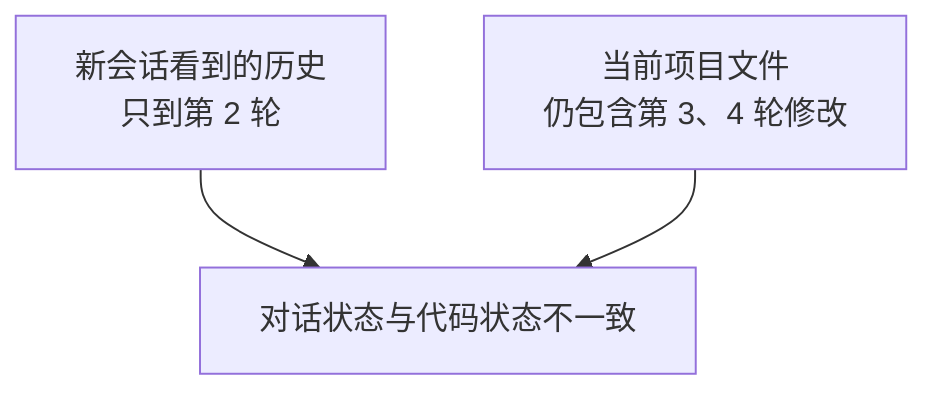

#### 如何同时回退对话和代码

如果希望真正回到某个历史节点，需要同时管理两种状态：


- 会话分支：恢复当时的需求、讨论和上下文
- Git Commit：恢复当时的代码版本
- Worktree：为新路线创建独立的项目目录

#### 会话分支与 Worktree 的组合

如果只创建会话分支，但两个会话继续使用同一个本地项目目录，那么两个会话仍然可能修改同一套文件。

```
flowchart TD
    A["原会话"]
    B["分支会话"]
    W["同一个本地工作目录"]

    A --> W
    B --> W
```

这种情况下：

- 对话历史隔离
- 项目文件没有隔离

两个会话仍可能互相覆盖代码修改。

如果需要真正并行执行两种代码方案，应让两个会话使用不同 Worktree：

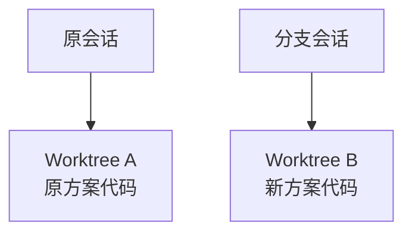

这样才能同时实现：

- 对话上下文隔离
- 项目文件隔离
- 未提交修改隔离
- Git 分支隔离

**只有不涉及代码增删改的任务，才可以仅创建会话分支。**

### Worktree


Worktree（工作树）是一种 **Git 提供的并行开发机制**，它可以**为同一个代码仓库创建多个独立的物理工作目录**，使不同任务能够同时修改代码而互不干扰。

> 最初通过 `git clone` 得到的项目目录，本身就是一个 Worktree，通常称为“主工作树”。后来通过 `git worktree` 创建的是额外 Worktree。

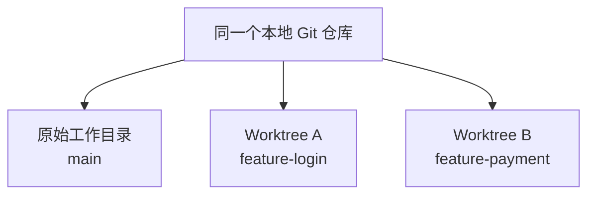

不同 Worktree：

- 共享 Git 数据库
- 拥有各自完整的项目文件
- 拥有各自的未提交修改
- 可以处理不同分支或不同任务

> Worktree 是本地项目目录；分支是 Git 历史中的提交指针。
>
> Worktree 可以把某个分支对应的代码检出出来。但为了防止两个目录同时修改同一个分支指针，同一个分支通常不能同时被两个 Worktree 检出。

#### 为什么使用 Worktree

如果直接在本地项目中让多个 Codex 任务同时修改代码，可能出现：

- 不同任务修改混在一起
- 一个任务覆盖另一个任务的代码
- 测试结果相互影响
- 提交时难以区分修改来源
- 无法安全切换分支

使用 Worktree 后，每个任务都有独立目录：

```
一个任务 → 一个 Worktree → 一组修改 → 一个分支 → 一个提交或 Pull Request
```

特别适合：

- **同时开发多个功能**
- 一边开发功能，一边修复 Bug
- 让多个 Codex 任务并行工作
- 尝试风险较高的重构
- 保持本地主工作区干净
- 在不打断当前工作的情况下执行后台任务

#### 为什么修改互不影响

假设两个目录中都有 `Home.vue`：

```
D:\projects\shop\src\Home.vue
D:\projects\shop-login\src\Home.vue
```

它们是硬盘上两个不同位置的文件。

你在 `shop-login` 中修改：

```
D:\projects\shop-login\src\Home.vue
```

不会改变：

```
D:\projects\shop\src\Home.vue
```

因为它们不是同一个文件。

#### 分支对 Worktree 的作用

例如，Git 仓库中有两个分支：

- `main`：稳定版本
- `feature-login`：登录功能版本

可以让不同 Worktree 使用不同分支：

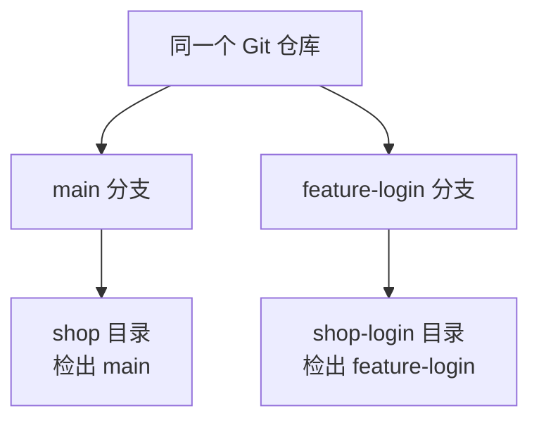

于是：

- 在 `shop` 目录提交代码，会推进 `main`

- 在 `shop-login` 目录提交代码，会推进 `feature-login`

- 两边的文件和未提交修改彼此独立

- 两边产生的提交都保存在同一个 Git 数据库中

- Worktree 不会自动同步。要让另一个 Worktree 使用新代码，仍然需要执行合并或切换到相应提交。

    > 可以理解为：两个房间共用一个档案室，但每个房间桌面上的文件不会自动同步。

#### 同一个分支不能同时用于两个 Worktree

假设两个 Worktree都使用 `feature-login`：

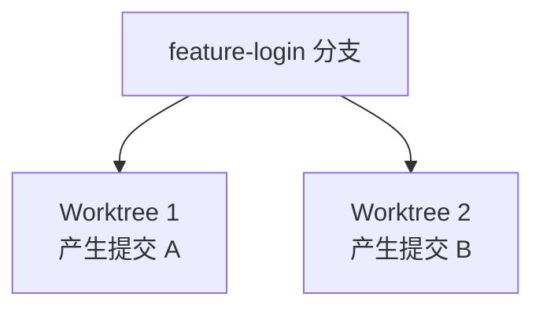

两个目录可能同时尝试改变 `feature-login` 指向的提交，Git将无法确定哪一个才是该分支的权威状态。

因此，Git通常禁止同一个分支同时被两个 Worktree检出。

正确方式是：

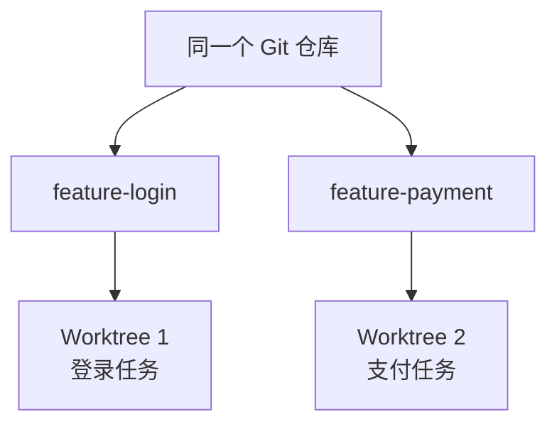

一个任务使用一个 Worktree，同时使用一个独立分支。

#### 推荐工作流程

```
为每个任务创建独立 Worktree
    ↓
Codex 修改并运行测试
    ↓
人工检查差异
    ↓
在 Worktree 中创建功能分支
    ↓
提交并推送
    ↓
创建 Pull Request
    ↓
合并回主分支
```


## Codex 记忆系统

新建任务后，Codex 不会自动继承旧任务的完整对话历史。当前任务通常需要通过以下来源重新获得必要信息：

- 当前任务的对话上下文
- 当前打开的项目文件
- `AGENTS.md` 中的持久指令
- Codex 本地记忆
- 用户主动提供的文档、需求和历史结论

### 先区分三种机制

| 机制           | 主要作用                   | 保存什么                     |
| -------------- | -------------------------- | ---------------------------- |
| 当前对话上下文 | 维持本次任务的连续性       | 当前对话、工具结果和临时信息 |
| `AGENTS.md`    | 让 Codex稳定遵守明确规则   | 工作约定、验证命令、风险边界 |
| Codex Memories | 从以前的任务中回顾有用信息 | 稳定偏好、项目经验、历史结论 |

它们之间的关系如下：

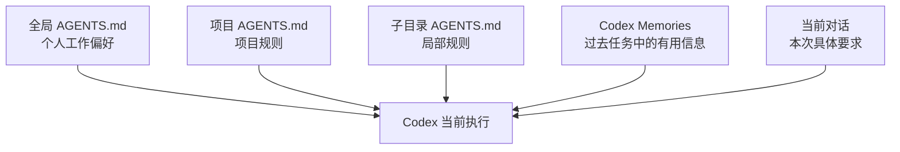

- `AGENTS.md` 告诉 Codex“必须怎样工作”
- Memories 帮助 Codex“回想以前知道什么”
- 当前提示词告诉 Codex“这次具体做什么”

### `AGENTS.md` 是什么

`AGENTS.md` 是 Agent 指令文件，**对其所在目录和子目录生效**。

Codex 会在开始工作前查找并读取符合规则的 `AGENTS.md`，将其中的内容加入当前任务的指令链。

它适合保存：

- 项目使用的技术栈和包管理器
- 构建、测试和代码检查命令
- 修改代码后必须完成的验证
- 不允许修改的目录和文件
- 团队代码风格
- 提交前检查要求
- 特定模块的特殊规则

注意：**`AGENTS.md` 不是由 Codex 自动维护的项目百科。只有明确要求 Codex 修改时，它才会修改该文件。**

### 全局自定义指令

在 Codex 的个性化设置中填写自定义指令。

其本质上是设置个人级别的全局指令，会被所有项目继承。


Codex 中的个人指令存储于全局 `AGENTS.md`。

> [OpenAI 官方文档：个性化 ChatGPT 和 Codex](https://learn.chatgpt.com/docs/personalize?translationFallback=zh-Hans)

默认位置是：

```
~/.codex/AGENTS.md
```

Windows上通常对应：

```
%USERPROFILE%\.codex\AGENTS.md
```

如果设置了 `CODEX_HOME`，则以自定义的 Codex 配置目录为准。

适合写入：

```
## 个人偏好

- 称呼我为红豆。
- 默认使用中文回答。
- 解释新概念时先讲原理，再给操作步骤。
- 对不确定的信息明确说明证据边界。

## 通用工作约定

- 修改 JavaScript 文件后运行 `npm test`。
- 安装依赖时优先使用 `pnpm`。
- 添加新的生产依赖前先说明原因并询问确认。
- 不要提交密钥、Token 或本地环境配置。
```

### 指令的读取顺序

Codex会把不同范围的指令组合成一条指令链：


可以简单理解为：

- 全局文件定义个人通用偏好
- 根目录文件定义项目通用规则
- 子目录文件定义模块规则
- 当前提示词定义本次具体任务

**发生冲突时，距离当前工作目录越近的指令通常拥有更高优先级**。

同一目录中如果存在 `AGENTS.override.md`，Codex 会优先使用它，而不是 `AGENTS.md`。

**组合后的项目指令存在大小限制，目前默认为 32 KiB。应避免把大量项目文档复制进 `AGENTS.md`**。

### Codex Memories

**Codex 提供独立的本地记忆功能。**

启用后，Codex 可以从符合条件的历史任务中提取有用信息，生成本地记忆，并在未来任务中按需使用。

> [OpenAI 官方文档：Codex Memories](https://learn.chatgpt.com/docs/customization/memories?translationFallback=zh-Hans)


它的工作过程可以理解为：


Codex 本地记忆具有以下特点：

- 默认关闭，需要用户主动开启
- 不会完整保存每段旧对话
- 只从符合条件的历史任务中提取有用信息
- 正在进行或持续时间很短的任务可能被跳过
- 记忆通常在后台生成，不一定在任务结束后立即出现
- 生成的记忆保存在本地 Codex 配置目录
- **记忆是辅助回顾信息，不是必须遵守规则的唯一来源**

默认存储位置是：

```
~/.codex/memories/
```

Windows上通常对应：

```
%USERPROFILE%\.codex\memories\
```

这些文件属于 Codex 生成的状态数据。可以在排查问题时检查，但**不建议把手动编辑内部记忆文件作为主要使用方式**。

在任务中输入：

```
/memories
```

可以控制：

- 当前任务能否使用已有本地记忆
- 当前任务能否成为以后生成记忆的来源

### 如何让 Codex 完善 `AGENTS.md`

不要简单要求：

```
把你学到的所有项目信息都写入 AGENTS.md。
```

这种提示词容易让 `AGENTS.md` 变成长篇项目摘要，还可能写入未经验证的推测。

更推荐使用：

```
通读当前项目，并完善项目根目录的 AGENTS.md。

要求：
- 只记录能够从代码、配置或现有文档中验证的信息；
- 重点记录构建命令、测试命令、目录边界和工作约定；
- 不要复制完整 README、文件树或 API 文档；
- 不要写入密钥、账号、Token 或个人隐私；
- 不要记录临时任务和容易过期的信息；
- 内容使用中文，保持简洁；
- 如果现有规则与项目实际情况冲突，先说明，不要直接覆盖；
- 修改完成后展示新增和修改的内容。
```

### 信息存放位置推荐

| 信息类型             | 推荐位置                         |
| -------------------- | -------------------------------- |
| 当前任务要求         | 当前提示词或任务计划             |
| 必须遵守的项目规则   | 项目根目录 `AGENTS.md`           |
| 特定模块规则         | 对应子目录的 `AGENTS.md`         |
| 个人通用工作偏好     | 全局 `AGENTS.md` 或自定义指令    |
| 以前任务中的辅助信息 | Codex Memories                   |
| 完整架构和接口说明   | 项目正式文档                     |
| 代码历史和回滚点     | Git Commit                       |
| 密钥和 Token         | 专用密钥管理工具，不写入上述文件 |


## Codex 插件


### 插件是什么

插件是安装到 ChatGPT 或 Codex 中的**可复用能力包**。它不只是“第三方服务器”，还可能包含：

- **Skill**：告诉 Codex 应该按照什么流程完成任务。
- **MCP Server**：连接 GitHub、Gmail 等外部服务，提供查询数据和执行操作的工具。
- **浏览器扩展**：为特定工作流程提供浏览器能力。
- **Hook**：在 Codex 生命周期的特定阶段执行命令。

插件可以来自 OpenAI、当前工作区或者个人和团队维护的插件市场。ChatGPT 与 Codex 在支持的界面中使用同一个公共插件目录；具体能看到哪些插件，还会受到套餐和工作区策略的影响。

> [OpenAI 插件说明](https://learn.chatgpt.com/docs/plugins?translationFallback=zh-Hans)

插件与外部服务的关系可以理解为：Codex 负责理解需求和规划任务，插件负责提供专用流程或工具，GitHub、Gmail 等外部服务负责保存数据并真正执行操作。

### 如何使用插件

1. **安装插件**：把插件提供的能力加入 Codex。
2. **连接账号**：让插件识别要访问的 GitHub 或 Gmail 账号。
3. **授予权限**：允许插件读取仓库、创建邮件草稿或发送邮件。
4. **执行操作**：真正查询 GitHub 或通过 Gmail 发出邮件。

安装插件并不等于已经授权全部操作，登录外部账号也不等于自动批准发送邮件。Codex 的沙箱和审批策略仍然有效，GitHub、Gmail 自身的账号权限同样有效。

**可以直接描述需求，让 Codex 自动选择工具；也可以输入 `@`，明确指定插件。然后说明用途。**


## Codex Skills

Codex 渐进式加载 Skills，不会一开始就读取 Skill 的完整内容。它会先读取各个 Skill 的前言（名称和描述），确定某个 Skill 与当前任务相关后，再加载其完整说明。减少对上下文空间的占用。

> [OpenAI Skills 官方说明](https://learn.chatgpt.com/docs/build-skills)

Skill 可以通过两种方式触发：

- **自动触发**：任务与 Skill 的 `description` 匹配时，Codex 自动选择。
- **明确调用**：在 Codex 中输入 `/skill-name` 指定使用某个 Skill。

`/skills` 用于打开或查看 Skill 列表。


### Skill 的来源

Codex 中的 Skill 大致可以分为：

- **系统 Skill**：由 OpenAI 维护，在 Codex 安装时提供
- **官方精选 Skill**：由 OpenAI 维护，根据需要手动安装
- **第三方 Skill**：来自其他开发者，安装前需要自行检查安全性
- **自定义 Skill**：由个人或团队编写

### Skill 的安装位置

```mermaid
flowchart TD
    A[准备安装 Skill] --> B{谁需要使用}
    B -->|只有当前项目| C[项目根目录<br/>.agents/skills]
    B -->|当前用户的所有项目| D[用户目录<br/>$HOME/.agents/skills]
    B -->|通过 $Skill Installer 安装| E[安装器管理目录<br/>$CODEX_HOME/skills]
```

**这三种目录中的有效 skill 都会被 Codex 自动识别**，通过开启新会话或重启 Codex。

在会话内通过 `$Skill Installer` 安装 Skill 已经**过时**，官方仅推荐前两种安装位置。

> 注意，第三方 Skill 数量很多，但质量、安全性和维护状态并不统一。安装前至少需要检查：
>
> - 是否存在完整的 `SKILL.md`
> - Skill 会读取或修改哪些文件
> - 是否包含可执行脚本
> - 是否会安装新的依赖
> - 是否需要联网或连接外部服务
> - 使用的开源许可证
> - 仓库是否仍然有人维护

### Codex 如何识别 Skill

识别过程：

```mermaid
flowchart TD
    A["扫描规定的 Skills 目录"]
    B["寻找包含 SKILL.md 的文件夹"]
    C["解析 YAML 元数据"]
    D{"是否包含有效的<br/>name 和 description？"}
    E["忽略该 Skill"]
    F["登记 Skill 的<br/>名称、描述和文件路径"]
    G["显示在 Skill 列表中"]
    H["显式调用或描述匹配"]
    I["读取完整 SKILL.md"]

    A --> B --> C --> D
    D -->|"否"| E
    D -->|"是"| F --> G --> H --> I
```

最低有效结构：

```
$HOME/.agents/skills/
└── good-test/
    └── SKILL.md
```

`SKILL.md` 最少需要：

```
---
name: iwen-creative（非空）
description: 创建宣传海报和创意视觉。当用户要求制作海报、活动主图或宣传图片时使用。（非空）
---

这里填写 Skill 被调用后的具体执行规则（可选）。
```

**文件夹名和 Skill 名可以不同，实际以 `SKILL.md` 中前言部分的 `name` 值作为 Skill 名称。**

### Skill 的权限边界

Skill 不会绕过 Codex 的权限管理。即使 `SKILL.md` 要求执行某项操作，实际运行时仍然受沙箱限制：

```mermaid
flowchart LR
    A[Skill 提出操作步骤] --> B[Codex 准备调用工具]
    B --> C{当前权限是否允许}
    C -- 允许 --> D[执行操作]
    C -- 不允许 --> E[请求授权或报告无法执行]
```


## Codex MCP


### MCP 是什么

除了插件和 Skill，还可以通过 MCP 扩展 Codex 的能力。

MCP 全称 **Model Context Protocol，模型上下文（通信）协议**。用于让 AI 模型与外部工具和数据源进行通信。

可以这样理解：

- **Codex**：负责理解需求、规划任务和决定调用哪个工具
- **MCP 连接**：负责按照统一协议**传递请求和结果**
- **MCP Server**：负责提供具体工具和数据
- **外部服务**：真正保存数据或执行操作，例如 GitHub、Figma、浏览器和内部文档系统

```mermaid
flowchart LR
    A[用户] --> B[Codex]
    B --> A
    B --> C[MCP 连接]
    C --> D[MCP Server]
    D --> E[GitHub API]
    E --> D
    D --> C
    C --> B
```

MCP Server 可以向 Codex 提供：

- 第三方文档和共享知识
- 查询和操作工具
- 访问 GitHub、Figma、浏览器等外部系统的能力

> [OpenAI MCP 官方说明](https://learn.chatgpt.com/docs/extend/mcp?translationFallback=zh-Hans)

### MCP、Skill、插件的区别

| 能力       | 主要作用                                     |
| ---------- | -------------------------------------------- |
| Skill      | 告诉 Codex 应该按照什么流程完成任务          |
| MCP        | 规定 Codex 如何连接外部工具/数据源           |
| MCP Server | 真正提供查询和操作工具                       |
| 插件       | 可安装的软件包，可以包含 Skill 和 MCP Server |

```mermaid
flowchart LR
    A[插件] --> B[Skill<br/>规定工作流程]
    A --> C[MCP Server<br/>提供外部工具]
    B --> D[Codex 按流程工作]
    C --> D
```

直接配置 MCP 的优点是控制更细，可以自行设置服务器地址、认证信息、可用工具和审批方式；插件则更适合希望简化安装流程的普通用户。

### Git 与 GitHub MCP 的区别

Codex 可以通过 Git 命令完成本地版本管理，例如：

- 查看和修改文件
- 创建分支
- 创建提交
- 合并分支
- 拉取或推送代码

但是 Issue、Pull Request、PR 评论和 GitHub Actions 等内容保存在 GitHub 平台上，不属于 Git 仓库本身。

```mermaid
flowchart TD
    A[本地 Git 仓库] --> B[文件、分支和提交]
    A --> C[push / pull]

    C --> D[GitHub 远程仓库]
    D --> E[Issue]
    D --> F[Pull Request]
    D --> G[PR 评论和审查]
    D --> H[GitHub Actions]
```

这些功能需要通过 GitHub 网站、GitHub CLI、GitHub 插件或者 GitHub API 操作。GitHub MCP Server 的作用，就是把 GitHub API 封装成 Codex 能够调用的工具。

MCP 并不是完成这些操作的唯一方法。例如，已经安装并登录 GitHub CLI 时，也可以使用 `gh issue`、`gh pr` 等命令。