## 一句话理解 Git

Git 是一个**代码版本管理系统**。

它会记录项目每一次确认后的状态，让开发者可以：

- 查看谁修改了什么
- 回到以前的版本
- 同时开发不同功能
- 把各自的代码合并起来

可以把 Git 理解为一个带分支功能的“游戏存档系统”：

```
修改代码 = 正在玩游戏
暂存修改 = 选择哪些进度要保存
提交 Commit = 创建一个正式存档
分支 Branch = 从某个存档开始另一条路线
合并 Merge = 把两条路线的成果整合起来
远程仓库 = 团队共享的存档服务器
```

## Git 管理的三个区域

使用 Git 时，代码主要经过三个区域。

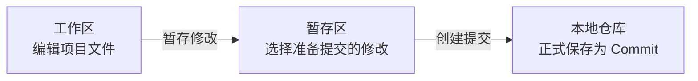

1. **工作区**：就是你在电脑上实际看到的项目文件夹。修改代码时，首先改变的是工作区中的文件。此时修改还没有成为正式的 Git 版本。
2. **暂存区**：暂存区用于选择“下一次准备提交哪些修改”。例如同时修改了五个文件，但只希望先提交其中三个，就可以只暂存这三个文件。
3. **本地仓库**：执行提交后，Git 会在本地仓库中创建一个新的版本记录，也就是 Commit。

## Commit 是什么

Commit 可以理解为项目的一个正式存档点。

每个 Commit 主要记录：

- 当前项目的文件状态
- 提交说明
- 提交者
- 提交时间
- 上一个 Commit
- 唯一的提交编号

例如，项目可能依次产生三个 Commit：

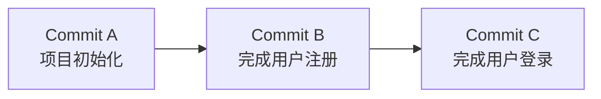

每个 Commit 都有类似下面这样的唯一编号：

```
766414756a4941159d2cd1249a62e1119342216c
```

因此，可以准确指定某一个历史版本：

- 把代码恢复到 Commit C
- 比较 Commit B 和 Commit C
- 撤销 Commit C 带来的修改

从逻辑上看，**Commit保存的是一次项目快照；但 Git内部会复用没有变化的数据，并不是每次提交都把整个项目完整复制一遍**。

Commit一旦创建，其内容就不会再被直接修改。后续修改会形成新的 Commit。这使得项目历史能够被检查、比较和回退。

## Branch 是什么

分支并不是完整复制出来的一套代码，也不是一个单独的文件夹。它本质上是一个**指向某个 Commit 的可移动标记**（某次提交的代号）。

假设项目现在有三个 Commit，`main` 分支指向最新的 Commit C：

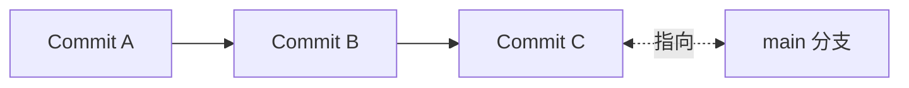

从 `main` 分支创建 `feature-login` 分支时，并不会复制整个项目。两个分支最初都指向 Commit C：

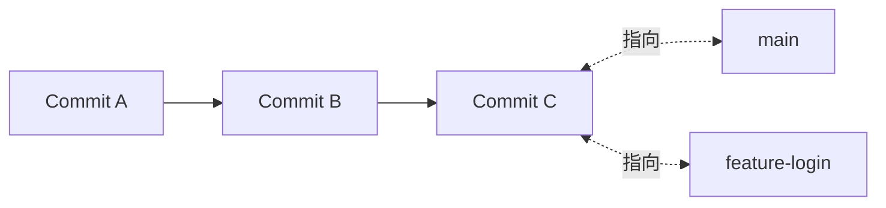

随后，在 `feature-login` 分支提交登录功能，产生新的 Commit D：

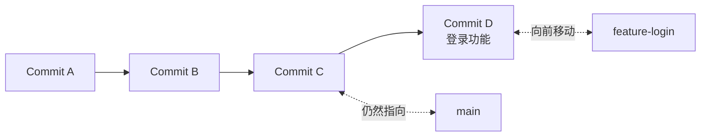

这时：

- `main` 仍然指向 Commit C
- `feature-login` 已经前进到 Commit D
- 登录功能只存在于 `feature-login`
- `main` 不会自动受到影响

所以，分支真正隔离的是**提交历史的发展路线**。

## 多人开发为什么不会互相影响

假设项目的主分支目前指向 Commit C0。

小王负责登录功能，小李负责支付功能。两个人都从 C0 创建自己的分支：

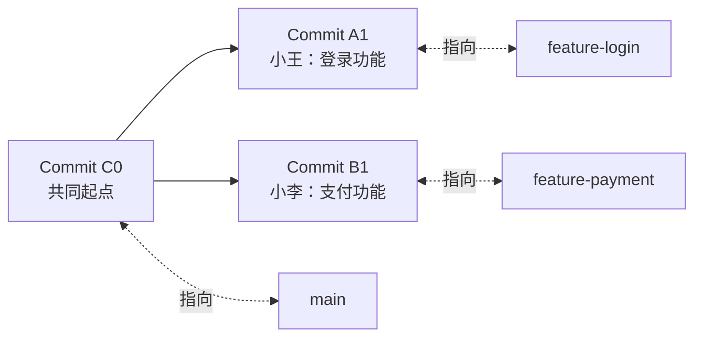

小王在自己的电脑和 `feature-login` 分支上工作，小李在自己的电脑和 `feature-payment` 分支上工作。

两个人拥有：

- 各自独立的项目目录
- 各自独立的未提交修改
- 各自独立的本地仓库
- 各自独立的功能分支

因此，小王修改登录代码时，小李电脑上的代码不会跟着改变。只有主动拉取或合并对方的提交，对方的代码才会进入自己的分支。

## 远程仓库是什么

每位开发者都有自己的本地仓库，但团队还需要一个共同交换代码的地方，这就是远程仓库。

> 远程仓库并不会实时同步每个人正在编辑的文件，仅保存已经提交并推送的 Git 历史。

常见的远程仓库平台包括：

- GitHub
- GitLab
- Gitee

多人通过远程仓库交换已经提交的代码：

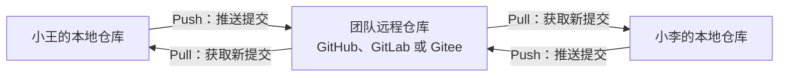

- **Push**：把本地提交上传到远程仓库
- **Pull**：把远程仓库中的新提交下载并整合到当前分支
- **Clone**：把远程仓库完整下载到自己的电脑，形成一个完整的本地仓库

## 多人协作的标准流程

假设小王准备开发登录功能。

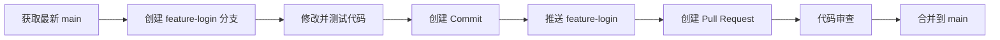

具体含义如下：

1. 从远程仓库获取最新代码
2. 从 `main` 创建自己的功能分支
3. 在功能分支中修改代码
4. 完成一个阶段后创建 Commit
5. 把功能分支推送到远程仓库
6. 创建 Pull Request 或 Merge Request
7. 团队成员检查代码
8. 确认无误后，将功能分支合并到 `main`

## Merge 是什么

Merge 用于把一个分支中的提交整合到另一个分支。

例如，登录功能从 Commit C0 开始开发，并产生 Commit A1：

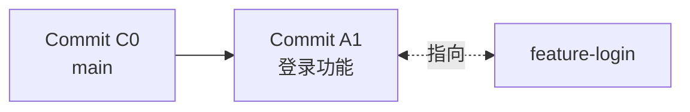

登录功能完成后，将 `feature-login` 合并到 `main`：

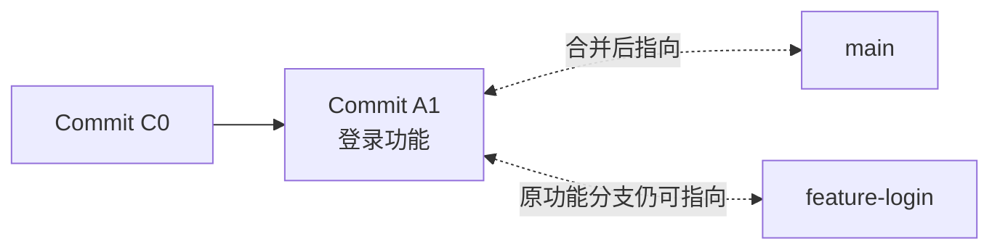

如果两个分支分别修改了不同文件，Git通常可以自动完成合并。

例如：

- 小王修改 `LoginService.java`
- 小李修改 `PaymentService.java`

### Conflict 是什么

如果两个人修改了同一个文件中的同一处代码，Git无法判断应该保留哪一份，就会产生冲突。

例如，原来的代码是：

```
系统名称：商城
```

小王修改为：

```
系统名称：百战商城
```

小李修改为：

```
系统名称：在线购物平台
```

Git 无法替团队决定最终名称，于是暂停合并并要求人工处理。

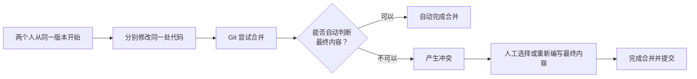

处理冲突并不意味着代码已经损坏，只代表 Git需要开发者明确告诉它最终应该保留什么。

还需要注意：即使 Git没有报告冲突，也不代表程序逻辑一定正确。两个人可能修改了不同文件，但这些修改组合后产生业务问题。因此，**合并后仍然需要运行测试**。

### Merge 是否会产生提交点

假设执行：

```
git switch A
git merge B
```

含义是：

> 把 B 分支合并到 A 分支。

此时：

- A 是目标分支，会被更新
- B 是来源分支，保持不变
- 是否产生新提交，需要看具体情况。

反过来，在 B 分支合并 A，则更新的是 B，A 保持不变。

#### 情况一：产生新的合并提交

如果 A、B 已经分别产生了不同提交：

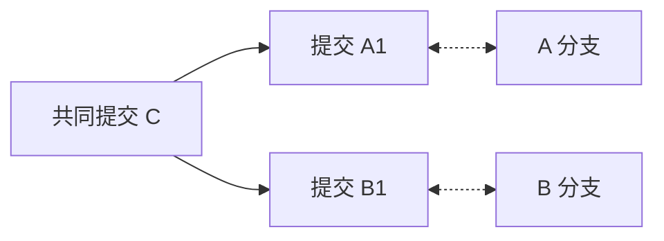

在 A 分支中合并 B：

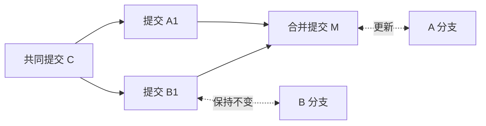

Git 创建新的合并提交 `M`。它同时记录两个父提交：

- `A1`
- `B1`

#### 情况二：不会产生新的提交

假设 A 没有自己的新提交，而 B 已经在 A 的基础上继续开发：

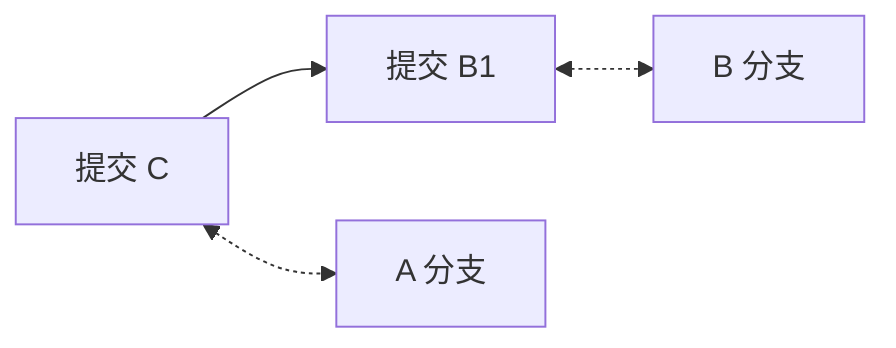

在 A 中合并 B 时，Git 发现不需要整合两条不同路线，只需把 A 的指针移动到 B1：

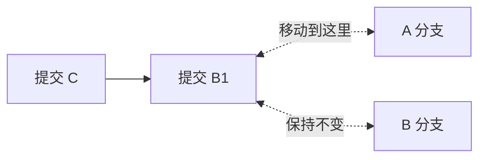

这叫作 **Fast-forward Merge（快进合并）**。此时默认不会创建新的合并提交。

#### 情况三：两个分支已经相同

如果 A 已经包含了 B 的全部提交，再执行“A 合并 B”，Git 会提示已经是最新状态：


## Git 如何保护多人协作

Git 主要通过以下机制降低相互影响。

- **每个人都有独立的本地目录**：正在编辑和尚未提交的代码只存在于自己的电脑上。
- **每个功能使用独立分支**：不同任务沿着不同的提交路线发展，不会直接修改主分支。
- **每次提交都有明确记录**：可以看到修改内容、提交者、提交时间和前后版本。
- **合并是明确操作**：功能分支不会自动进入主分支，必须主动执行合并。
- **冲突不会被静默覆盖**：遇到无法自动合并的修改时，Git会停止操作并要求人工决定。
- **远程平台可以增加审核规则**：
    - 必须通过 Pull Request 才能合并
    - 必须经过代码审查
    - 必须通过自动测试
    - 禁止直接推送到 `main`
    - 禁止强制覆盖远程历史

## Git 并不能绝对保证互不影响

“互不影响”主要是指开发过程被隔离，而不是永远不会出现问题。

Git 可以防止不同开发者的代码在编辑过程中直接混在一起，但不能自动保证：

- 两个人的功能逻辑没有冲突
- 合并后的程序一定能够运行
- 开发者不会错误解决冲突
- 没有人误提交密钥或临时文件
- 没有人使用强制推送覆盖历史
- 所有提交都符合项目要求

可靠的多人协作需要多种机制共同配合：

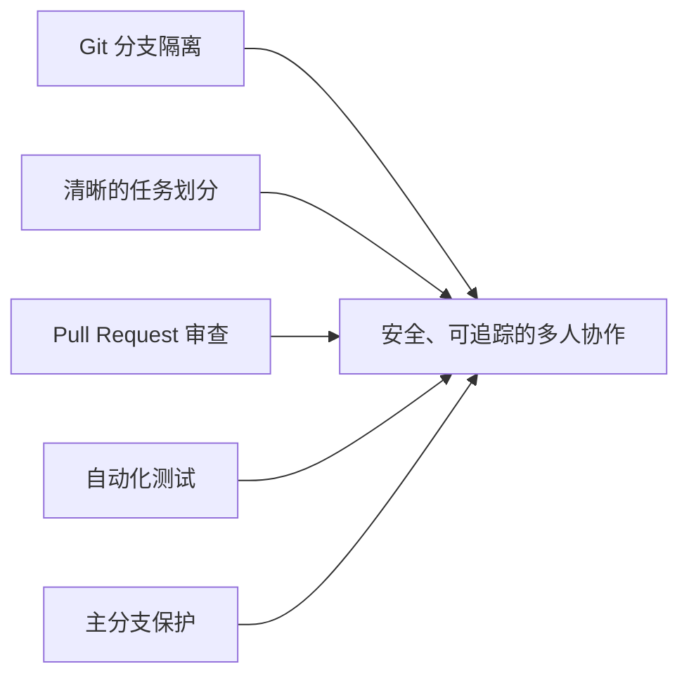


## 普通项目变成 Git 仓库的完整过程

一个普通项目变成可协作的 Git项目，通常经历以下过程：

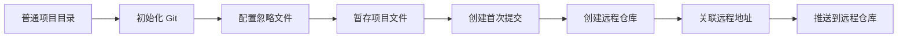

需要区分三个状态：

1. 执行 `git init`：已经成为**本地 Git仓库**。
2. 执行 `git commit`：本地仓库中已经拥有正式版本。
3. 执行 `git push`：正式版本已经上传到**远程 Git仓库**。

### 第一步：最初只是普通项目

假设有一个普通商城项目：

```tex
shop
├── src
├── pom.xml
├── README.md
└── target
```

此时：

- 项目可以正常开发和运行
- Git还没有管理这些文件
- 没有提交历史
- 没有分支
- 无法使用 Git比较或回退版本

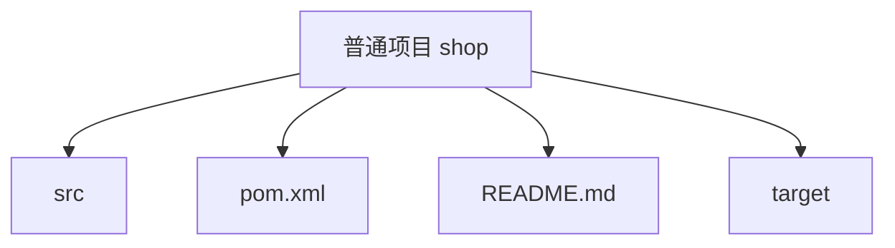

### 第二步：初始化本地 Git 仓库

进入项目根目录，执行：

```bash
git init -b main
```

该命令表示：

- 在当前目录中初始化 Git；
- 将默认分支名称设置为 `main`。

执行后，项目根目录中会出现隐藏的 `.git` 目录：

```tex
shop
├── .git
├── src
├── pom.xml
├── README.md
└── target
```

这时，项目已经是一个本地 Git仓库。


但是，此时还没有创建任何 Commit，项目文件通常都处于“未跟踪”状态。

#### `.git` 目录是什么

`.git` 是整个本地 Git仓库最核心的目录。

它保存的不是日常编辑的项目源码，而是 Git管理项目所需的数据：

```mermaid
flowchart TD
    G[".git<br/>Git 仓库数据库"]

    HEAD["HEAD<br/>当前所在分支或提交"]
    CONFIG["config<br/>仓库配置和远程地址"]
    OBJECTS["objects<br/>文件内容和提交对象"]
    REFS["refs<br/>分支和标签指针"]
    INDEX["index<br/>暂存区"]
    HOOKS["hooks<br/>Git 钩子脚本"]

    G --> HEAD
    G --> CONFIG
    G --> OBJECTS
    G --> REFS
    G --> INDEX
    G --> HOOKS
```

其中最重要的内容包括：

| 产物           | 作用                                       |
| -------------- | ------------------------------------------ |
| `.git/HEAD`    | 记录当前使用的分支或提交                   |
| `.git/config`  | 保存当前仓库的配置和远程地址               |
| `.git/objects` | 保存文件内容、目录结构和提交对象           |
| `.git/refs`    | 保存分支和标签指向的提交                   |
| `.git/index`   | 保存暂存区内容，通常在暂存文件后创建或更新 |
| `.git/hooks`   | 保存可选的 Git自动化脚本                   |

`.git` 一旦丢失，项目文件可能仍然存在，但 Git 提交历史、分支和版本管理信息会丢失。

因此：项目中是否存在有效的 `.git`，是判断它是否为本地 Git 仓库的重要依据。

### 第三步：创建 `.gitignore`

正式添加文件前，应先创建 `.gitignore`：

```
shop
├── .git
├── .gitignore
├── src
├── pom.xml
├── README.md
└── target
```

`.gitignore` 用于告诉 Git哪些文件不应该纳入版本管理。

Java项目中常见的配置是：

```
target/
.idea/
*.iml
*.log
.env
```

Node.js 项目中常见的配置是：

```
node_modules/
dist/
.env
*.log
```

通常应排除：

- 依赖目录
- 编译产物
- 日志和缓存
- IDE本地配置
- 临时文件
- 密钥和本地环境变量文件

`.gitignore` 本身应该提交到仓库，让团队成员共享相同的忽略规则。

需要注意：

> `.gitignore` 只对尚未被 Git跟踪的文件生效。如果密钥已经提交，仅仅加入 `.gitignore` 并不能从历史记录中删除密钥。

### 第四步：检查文件状态

执行：

```bash
git status
```

此时 Git通常会显示：

- 当前分支
- 尚无提交
- 未跟踪文件
- 等待暂存的修改

状态变化如下：

```mermaid
flowchart LR
    A["项目文件已经存在"]
    B["Git 尚未跟踪"]
    C["git status"]
    D["显示为未跟踪文件"]

    A --> B --> C --> D
```

`git status` 不会修改文件，只负责显示当前 Git状态。

### 第五步：将文件加入暂存区

执行：

```bash
git add .
```

这里的 `.` 表示选择当前目录及其子目录中符合条件的修改。

Git会：

- 读取项目文件
- 遵守 `.gitignore` 规则
- 将需要提交的文件内容放入暂存区
- 创建或更新 `.git/index`
- 为相关文件内容生成 Git对象

```mermaid
flowchart LR
    A["未跟踪或已修改的文件"]
    B["执行 git add"]
    C["按照 .gitignore 排除文件"]
    D["选中的内容进入暂存区"]
    E["等待创建 Commit"]

    A --> B --> C --> D --> E
```

执行 `git add` 后：

- 项目文件仍然位于原来的位置
- Git不会把源码移动到 `.git` 中
- 只是记录“下一次提交准备包含哪些内容”
- 此时仍然没有产生 Commit

### 第六步：创建第一次提交

执行：

```bash
git commit -m "Initial commit"
```

`Initial commit` 是提交说明，表示“第一次提交”。

Git会创建第一个 Commit：

```mermaid
flowchart LR
    A["暂存区中的项目状态"]
    B["执行 git commit"]
    C["创建第一个 Commit"]
    D["生成唯一提交编号"]
    E["main 指向该 Commit"]

    A --> B --> C --> D --> E
```

第一次提交主要产生以下信息：

- 项目文件快照
- 目录结构
- 提交说明
- 提交者
- 提交时间
- 唯一提交编号

例如：

```
7e8f1c2 Initial commit
```

第一次提交没有上一个父提交。后续提交会指向前一个提交：

```mermaid
flowchart LR
    A["Commit A<br/>Initial commit"]
    B["Commit B<br/>添加用户登录"]
    C["Commit C<br/>修复登录错误"]
    MAIN["main"]

    A --> B --> C
    C -.->|"指向"| MAIN
```

到这里，即使没有连接 GitHub、GitLab 或 Gitee，项目也已经是一个完整的本地 Git仓库，并且可以：

- 查看修改
- 创建分支
- 创建更多提交
- 比较版本
- 回退代码
- 创建 Worktree

### 第七步：创建远程仓库

接下来，可以在 GitHub、GitLab 或 Gitee上创建远程仓库。

例如，在 Gitee上创建：

```
https://gitee.com/username/shop.git
```

推荐为已有本地项目创建一个**空的远程仓库**，暂时不要勾选自动生成：

- README
- `.gitignore`
- License

否则远程仓库会提前产生一个本地没有的提交，第一次推送时可能需要额外合并历史。

创建远程仓库后，会产生：

- 一个远程仓库地址
- 一个远程 Git数据库
- 项目的访问权限设置；
- 用于团队协作的网页入口

但此时，本地仓库与远程仓库还没有建立联。

```mermaid
flowchart LR
    L["本地 Git 仓库<br/>已经有 Initial commit"]
    R["远程 Git 仓库<br/>目前为空"]

    L -.->|"尚未关联"| R
```

### 第八步：关联远程仓库

执行：

```bash
git remote add origin https://gitee.com/username/shop.git
```

这条命令表示：

- 添加一个远程仓库；
- 将其命名为 `origin`；
- 保存远程仓库地址。

`origin` 只是远程仓库的默认别名，也可以使用其他名称。

关联后，远程地址会被记录在：

```
.git/config
```

逻辑关系如下：

```mermaid
flowchart LR
    L["本地仓库"]
    O["远程别名 origin"]
    R["Gitee 远程仓库"]

    L --> O --> R
```

此时只是记录了远程地址，代码还没有上传。

可以使用下面的命令检查远程地址：

```bash
git remote -v
```

### 第九步：推送到远程仓库

执行：

```bash
git push -u origin main
```

这条命令表示：

- `push`：上传本地提交；
- `origin`：上传到名为 `origin` 的远程仓库；
- `main`：上传本地 `main` 分支；
- `-u`：建立本地 `main` 与远程 `origin/main` 的跟踪关系。

```mermaid
flowchart LR
    L["本地 main<br/>包含 Initial commit"]
    P["执行 git push"]
    R["远程 origin/main<br/>接收提交和文件版本"]
    T["建立本地与远程分支的跟踪关系"]

    L --> P --> R
    P --> T
```

推送时上传的主要内容包括：

- Commit 对象；
- 被提交的文件内容；
- 项目目录结构；
- 分支指针；
- 相关 Git 历史。

不会上传：

- 尚未提交的修改；
- 暂存但尚未提交的内容；
- 被 `.gitignore` 排除的文件；
- 其他没有纳入提交的本地文件。

推送完成后，Gitee网页上就可以看到项目代码和提交历史。

### 本地与远程分别有哪些产物

完成整个流程后，本地目录中主要存在：

```
shop
├── .git
├── .gitignore
├── src
├── pom.xml
└── README.md
```

本地产物可以分为两类：

| 类型        | 内容                                    |
| ----------- | --------------------------------------- |
| 项目文件    | `src`、`pom.xml`、`README.md` 等        |
| Git管理数据 | `.git` 中的提交、分支、暂存区和远程配置 |

远程仓库中主要存在：

- 被提交并推送的项目文件版本；
- Commit历史；
- `main` 等远程分支；
- 标签；
- 仓库权限和协作配置；
- Pull Request 或 Merge Request 等协作记录。

### `.gitignore` 会不会上传

`.gitignore` 本身通常会被提交并上传。

它里面记录的是忽略规则，例如：

```
.env
target/
node_modules/
```

实际效果是：

```mermaid
flowchart TD
    P["项目文件"]

    A["src<br/>需要提交"]
    B["README.md<br/>需要提交"]
    C[".gitignore<br/>需要提交"]
    D[".env<br/>被忽略"]
    E["target<br/>被忽略"]

    P --> A --> R["进入 Commit 并推送"]
    P --> B --> R
    P --> C --> R
    P --> D --> X["不进入 Commit"]
    P --> E --> X
```

### 最常用的完整命令

假设已经进入项目根目录：

```
git init -b main
git status
git add .
git commit -m "Initial commit"
git remote add origin https://gitee.com/username/shop.git
git push -u origin main
```

如果当前电脑是第一次使用 Git，还需要配置提交者身份：

```
git config --global user.name "你的名字"
git config --global user.email "你的邮箱"
```

这项配置通常只需要执行一次。

### 整个过程中项目状态如何变化

```mermaid
flowchart TD
    A["普通项目<br/>只有项目文件"]
    B["本地 Git 仓库<br/>生成 .git"]
    C["已暂存项目<br/>生成或更新暂存区"]
    D["拥有正式版本<br/>创建 Initial commit"]
    E["已关联远程仓库<br/>保存 origin 地址"]
    F["可远程协作<br/>提交已经推送"]

    A -->|"git init"| B
    B -->|"git add"| C
    C -->|"git commit"| D
    D -->|"git remote add"| E
    E -->|"git push"| F
```

最重要的结论是：

> `git init` 让普通项目成为本地 Git仓库，`git add` 选择提交内容，`git commit` 创建正式版本，`git remote add` 关联远程仓库，`git push` 才把本地提交上传到 GitHub、GitLab 或 Gitee。